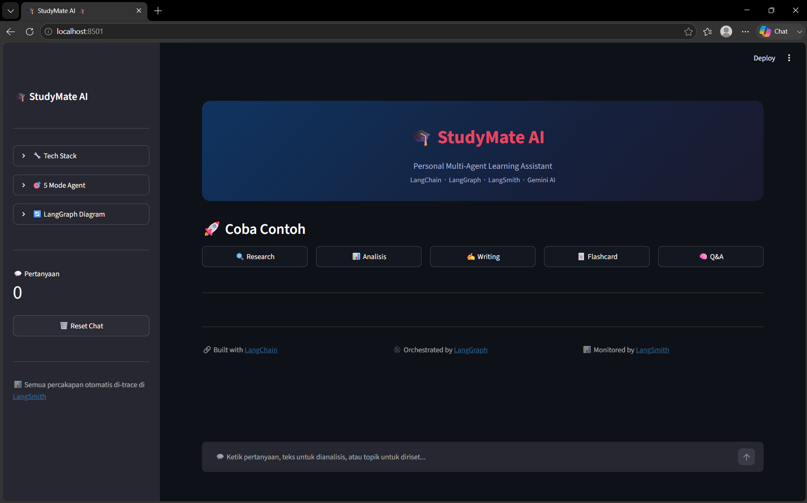

# 🎓 StudyMate AI — Personal Multi-Agent Learning Assistant

> Sistem asisten belajar berbasis LLM yang menggunakan arsitektur multi-agent untuk secara otomatis mendeteksi kebutuhan pengguna dan meneruskan ke agent yang tepat.


## 🏗️ Arsitektur

```
User Input
    ↓
[LangGraph StateGraph]
    ↓
Router Node → klasifikasi intent (LangChain)
    ↓
┌─ Research Node  → Web search + sintesis (Tavily + LangChain)
├─ Analysis Node  → Sentimen + key points (LangChain)
├─ Writing Node   → Esai + artikel (LangChain)
├─ Flashcard Node → Kartu belajar Q&A (LangChain)
└─ Q&A Node       → Jawaban langsung (LangChain)
    ↓
Response Output
[LangSmith traces semua interaksi secara otomatis]
```

## 🔧 Penggunaan Library Wajib

| Library | Peran di Project |
|---------|-----------------|
| **LangChain** | `ChatGoogleGenerativeAI` sebagai LLM, `ChatPromptTemplate` untuk system prompt tiap agent, `StrOutputParser` untuk parsing output, `TavilySearchResults` untuk web search |
| **LangGraph** | `StateGraph` untuk orkestrasi multi-agent, `TypedDict` state yang mengalir antar node, `add_messages` reducer, conditional edges untuk routing dinamis |
| **LangSmith** | Automatic tracing via `LANGCHAIN_TRACING_V2=true`, semua LLM call + chain + tool use otomatis ter-log di dashboard smith.langchain.com |

## 🚀 Fitur

- 🔍 **Research Mode** — Riset topik dengan web search real-time
- 📊 **Analysis Mode** — Analisis sentimen, key points, dan insight teks
- ✍️ **Writing Mode** — Generate artikel, esai, dan catatan belajar
- 🃏 **Flashcard Mode** — Buat kartu belajar otomatis dari topik apapun
- 🧠 **Q&A Mode** — Jawab pertanyaan langsung dengan penjelasan detail
- 📈 **LangSmith Monitoring** — Semua interaksi ter-trace otomatis

## 📦 Instalasi

```bash
# Clone repository
git clone https://github.com/username/studymate-ai.git
cd studymate-ai

# Buat virtual environment
python -m venv venv
source venv/bin/activate  # Mac/Linux | venv\Scripts\activate (Windows)

# Install dependencies
pip install -r requirements.txt

# Setup environment variables
cp .env.example .env
# Edit .env dan isi API keys
```

## ⚙️ Konfigurasi API Keys

Buat file `.env` di root project:

```
GOOGLE_API_KEY=    # https://aistudio.google.com/app/apikey (Free)
TAVILY_API_KEY=    # https://app.tavily.com (Free 1000 req/bulan)
LANGCHAIN_API_KEY= # https://smith.langchain.com (Free)
LANGCHAIN_PROJECT= StudyMate-AI
```

## ▶️ Cara Menjalankan

```bash
streamlit run app.py
```

Buka browser di `http://localhost:8501`

## 📸 Screenshot

### Halaman Utama Interface Streamlit


## 🗂️ Struktur Project

```
studymate-ai/
├── app.py           # Streamlit UI
├── graph.py         # LangGraph multi-agent workflow
├── chains.py        # LangChain chains & prompt templates
├── config.py        # Konfigurasi LangSmith & env vars
├── requirements.txt
├── .env.example
└── README.md
```